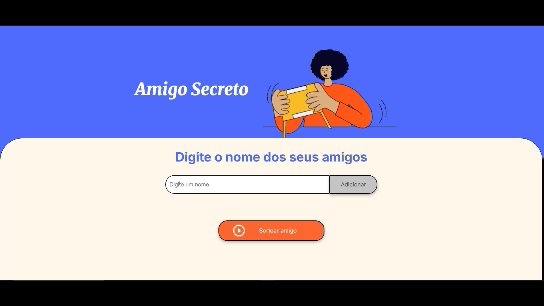

# 🎁 Sorteador de Amigo Secreto  

  
  
  

---

## 🔗 Acesso ao Projeto  

👉 [Clique aqui para acessar o deploy no GitHub Pages](https://marcia-branquinho-garcia.github.io/Amigo-Secreto/)  

---

## 📝 Descrição  

Este é um projeto simples e divertido desenvolvido como parte do programa **Oracle Next Education (ONE)** em parceria com a **Alura**.  
A aplicação permite aos usuários adicionar nomes de participantes a uma lista e, em seguida, realizar um sorteio para determinar quem é o **"amigo secreto"**.  

> 🎯 O objetivo principal foi praticar manipulação do **DOM** e lógica de programação com **JavaScript**.  

---

## 🎥 Demonstração  

  

---

## ✨ Funcionalidades  

- ➕ **Adicionar Nomes:** Inserir nomes de amigos em um campo de texto e adicioná-los à lista.  
- ✅ **Validação de Entrada:** Impede que nomes vazios sejam adicionados.  
- 📃 **Visualização da Lista:** Exibe todos os nomes adicionados em tempo real.  
- 🎲 **Sorteio Aleatório:** Seleciona aleatoriamente um nome e mostra o resultado.  

---

## 🚀 Tecnologias Utilizadas  

  
  
  

---

## 📂 Como Executar o Projeto  

Este projeto é uma aplicação web estática e não requer instalação complexa.  

1. **Clone o repositório:**
    ```bash
    git clone https://github.com/Marcia-Branquinho-Garcia/Amigo-Secreto.git
    ```
2. **Acesse a pasta do projeto:**
    ```bash
    cd Amigo-Secreto
    ```
3. **Abra o arquivo `index.html`:**  
   Basta abrir o arquivo no navegador de sua preferência.  

---

## 👩‍💻 Autor  

Desenvolvido com 💙 por **Marcia Branquinho Garcia**  

[](https://github.com/Marcia-Branquinho-Garcia)  
[](https://www.linkedin.com/in/marcia-branquinho-garcia-5935a9362/)  
